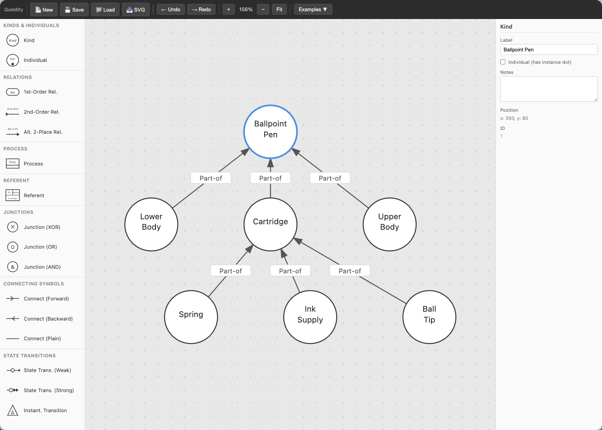

# Quiddity

Quiddity is a simple modeling tool that leverages IDEF5 for creating ontologies. I've been working with ontologies for many years and I always wanted a tool that could create models that used IDEF5. I created a [Visio stencil](https://github.com/robstand/IDEF5) some years back but I wanted something that ran in the browser, so Quiddity was born.

Learn more about [IDEF5](https://www.idef.com/idef5-ontology-description-capture-method/).

## How to use Quiddity

Quiddity is a SPA. Clone the repo and load up quiddity.html in your browser. I've included some example ontologies from the IDEF5 spec in the Examples menu.

